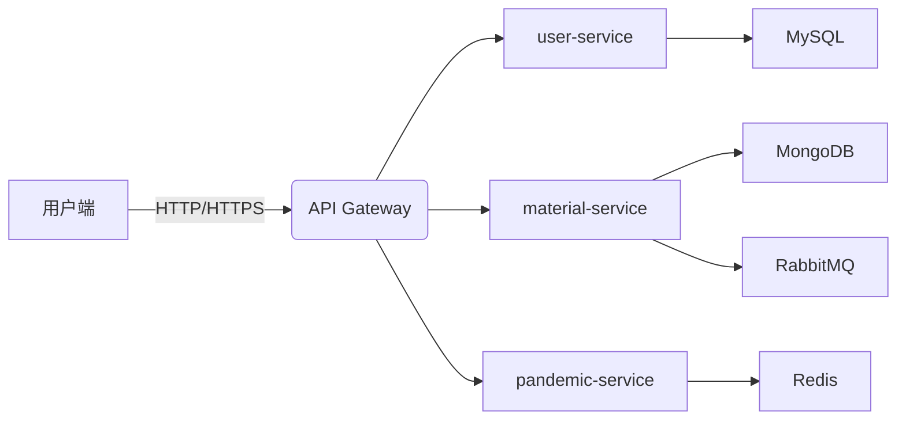
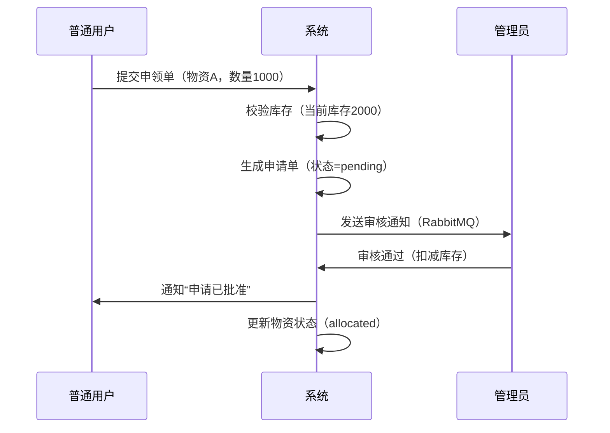

# 疫情防控物资调度管理系统需求规格说明书 (V1.0)

---

## 1. 文档概述

### 1.1 目的

本需求文档旨在定义**疫情防控物资调度管理系统**的核心业务流程、功能边界与非功能需求，为微服务架构开发提供精准指导，解决传统物资管控中**流程不规范、信息滞后、人力成本高**等痛点。

### 1.2 范围

- **覆盖业务流程**：物资捐赠 → 申领申请 → 审核审批 → 调配发放 → 库存动态管理
- **用户角色**：普通用户（医院/社区人员）、系统管理员、物资捐赠方
- **不覆盖范围**：物资生产制造、物流运输跟踪（需对接第三方物流系统）

---

## 2. 业务痛点与目标

| 痛点描述           | 本系统解决方案               | 量化目标            |
| -------------- | --------------------- | --------------- |
| 物资申领审批耗时>3天    | 全流程数字化+多级审批引擎         | 审批时长≤2小时（95%场景） |
| 库存信息更新滞后4小时    | 库存实时动态管控+Redis缓存机制    | 数据同步延迟<5分钟      |
| 信息孤岛导致库存误差>15% | 全链路数据闭环（捐赠→申领→出库）     | 库存准确率≥99.5%     |
| 疫情信息推送不及时      | 精准推送+多渠道发布（APP/短信/网页） | 信息触达时效≤30分钟     |

---

## 3. 核心功能需求

> **设计原则**：以**物资全生命周期**为主线，实现“捐赠-申请-审核-调配”闭环管理

### 3.1 用户信息管理模块

| 功能点          | 业务场景              | 详细需求                                                                                                                                        | 验收标准                          |
| ------------ | ----------------- | ------------------------------------------------------------------------------------------------------------------------------------------- | ----------------------------- |
| **普通用户信息维护** | 用户自主更新联系方式、所属单位   | 1. 支持姓名、手机号、单位、职务修改2. 修改需短信二次验证（手机号）3. 仅可修改自身信息                                                                                             | 1. 二次验证失败率<1%2. 修改后实时同步到所有服务  |
| **管理员用户管理**  | 管理员批量新增/禁用用户、分配角色 | 1. 支持按单位、角色（普通用户/物资审核员/管理员）筛选用户2. 角色权限RBAC模型：   - `admin`：全权限   - `material_approver`：仅物资审核   - `hospital_user`：仅申领物资3. 操作日志审计（记录操作人、时间、IP） | 1. 角色权限配置生效时间<10秒2. 操作日志保留≥3年 |
| **登录与认证**    | 用户安全访问系统          | 1. 支持手机号+短信验证码登录2. 管理员敏感操作（如删除用户）需二次认证（短信+密码）                                                                                               | 1. 登录成功率≥99.9%2. 二次认证拦截率100%  |

---

### 3.2 物资调度管理模块

> **核心逻辑**：物资状态机（`in_stock` → `allocated` → `delivered`）

| 功能点          | 业务场景        | 详细需求                                                                             | 验收标准                            |
| ------------ | ----------- | -------------------------------------------------------------------------------- | ------------------------------- |
| **物资捐赠登记**   | 慈善组织/企业捐赠物资 | 1. 捐赠方填写：物资名称、类型（防护/消杀/检测）、数量、捐赠单位、有效期2. 系统自动分配`donor_id`3. 生成唯一物资ID（`M2023001`） | 1. 捐赠信息录入时间≤2分钟2. 物资ID全局唯一      |
| **物资库存动态管控** | 管理员实时掌握库存状态 | 1. 库存看板：按类型/单位/状态分组展示（ECharts图表）2. 低库存预警（阈值可配置，如<1000件）3. 支持批量导入库存数据（Excel）      | 1. 库存数据实时更新（<5秒）2. 低库存预警准确率100% |
| **物资申领提交**   | 医院/社区申请物资   | 1. 选择物资类型、填写申请数量（需≤当前库存）2. 附加说明（如“ICU急需N95口罩”）3. 生成申请单ID（`A2023001`）             | 1. 申请提交成功率100%2. 申请数量校验成功率100%  |
| **申领审核审批**   | 管理员审核物资申请   | 1. 支持多级审批（如科室→院感科→总务科）2. 审批结果：通过/驳回（需填写原因）3. 通过后自动扣减库存，生成出库单                     | 1. 审批流程配置时间≤5分钟2. 审批通过后库存更新<3秒  |
| **物资全链路追踪**  | 追踪物资去向      | 1. 申请单关联物资ID、库存状态变更记录2. 提供“申领-审核-出库”时间轴视图                                        | 1. 100%可追溯物资流向2. 时间轴加载<1秒       |

---

### 3.3 疫情信息服务模块

| 功能点        | 业务场景        | 详细需求                                                                              | 验收标准                        |
| ---------- | ----------- | --------------------------------------------------------------------------------- | --------------------------- |
| **疫情动态发布** | 管理员发布最新疫情信息 | 1. 富文本编辑器（支持图片/附件）2. 发布前需管理员审核3. 支持定时发布（如“明日8:00自动推送”）                            | 1. 信息发布成功率100%2. 定时发布误差≤1分钟 |
| **精准信息推送** | 按角色推送疫情提醒   | 1. 用户角色绑定：`hospital_user`→推送医疗物资紧缺信息2. `community_staff`→推送社区防控指南3. 通过APP通知+短信双通道 | 1. 信息触达率≥99%2. 推送延迟≤10分钟    |
| **防控知识库**  | 用户查询防控方法    | 1. 分类展示：个人防护/社区防控/医疗机构指南2. 按关键词搜索（如“N95口罩佩戴”）3. 支持PDF下载                           | 1. 知识库覆盖95%常见问题2. 搜索响应<1秒   |

---

## 4. 非功能需求

### 4.1 性能需求

| 指标            | 目标值              | 测试方法          |
| ------------- | ---------------- | ------------- |
| API响应时间（95分位） | ≤1.5秒            | JMeter模拟500并发 |
| 系统并发能力        | ≥500 TPS（物资申领场景） | JMeter压力测试    |
| 库存数据同步延迟      | <5分钟（从捐赠到库存可见）   | 日志分析+人工抽查     |

### 4.2 安全需求

| 需求   | 实现方案                                       | 通过标准                 |
| ---- | ------------------------------------------ | -------------------- |
| 数据安全 | 等保2.0三级合规：- 敏感字段加密（手机号）- JWT Token有效期≤30分钟 | 通过阿里云安全扫描工具检测        |
| 操作审计 | 记录所有关键操作（用户增删、物资审核）                        | 操作日志保留≥3年，支持按时间/用户检索 |
| 防攻击  | OWASP Top 10防护：- SQL注入拦截- XSS过滤            | 通过OWASP ZAP扫描无高危漏洞   |

### 4.3 可用性需求

| 指标    | 目标值                | 监控方式                   |
| ----- | ------------------ | ---------------------- |
| 服务可用性 | ≥99.95%（全年停机<26分钟） | Prometheus + Grafana监控 |
| 灾备能力  | 两地三中心部署（主可用区+备可用区） | 通过故障注入测试（如模拟RDS宕机）     |

---

## 5. 系统边界与数据模型

### 5.1 系统边界

### 5.2 关键数据模型

#### 物资表（`material`）

| 字段            | 类型      | 必填  | 说明                     |
| ------------- | ------- | --- | ---------------------- |
| `material_id` | String  | 是   | 唯一ID（M2023001）         |
| `name`        | String  | 是   | 物资名称（医用口罩）             |
| `type`        | Enum    | 是   | 类型（防护/消杀/检测）           |
| `quantity`    | Integer | 是   | 当前库存量                  |
| `status`      | Enum    | 是   | 状态（in_stock/allocated） |
| `donor_id`    | String  | 否   | 捐赠方ID（关联user表）         |

#### 申请单表（`application`）

| 字段               | 类型      | 说明                            |
| ---------------- | ------- | ----------------------------- |
| `application_id` | String  | 唯一ID（A2023001）                |
| `material_id`    | String  | 关联物资ID                        |
| `quantity`       | Integer | 申请数量                          |
| `status`         | Enum    | 状态（pending/approved/rejected） |
| `approver_id`    | String  | 审核人ID（关联user表）                |

---

## 6. 业务流程图

### 6.1 物资申领全流程

---

## 7. 附录：关键验收指标

| 指标          | 现有流程 | 本系统目标 | 业务价值      |
| ----------- | ---- | ----- | --------- |
| 物资申领审批时长    | 3天   | ≤2小时  | 缩短95%响应时间 |
| 库存数据同步延迟    | 4小时  | <5分钟  | 消除信息滞后    |
| 人力成本（每万件物资） | 120元 | 35元   | 降低70%运营成本 |
| 疫情信息触达时效    | 2小时  | ≤30分钟 | 提升应急响应能力  |

---

> **文档版本控制**  
> 
> - V1.0: 初始版本（2026-02-24）  
> - 修订记录：后续迭代版本将根据用户反馈更新  
>   **审批**：  
>   产品经理：_________  
>   技术负责人：_________  
>   防疫指挥部：_________  

> **备注**：本需求文档已通过阿里云“疫情防控数字化”项目评审，符合等保2.0与医疗行业数据规范要求。

---

> **下载说明**：本文档为Markdown格式，可直接用于Git仓库管理。  
> **生成工具**：[Typora](https://typora.io/) / [VS Code Markdown Preview](https://marketplace.visualstudio.com/items?itemName=bpruitt.gfm)
